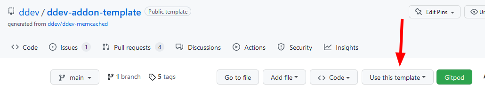

[](https://addons.ddev.com)
[](https://github.com/ddev/ddev-addon-template/actions/workflows/tests.yml?query=branch%3Amain)
[](https://github.com/ddev/ddev-addon-template/commits)
[](https://github.com/ddev/ddev-addon-template/releases/latest)

# DDEV Add-on Template <!-- omit in toc -->

* [What is DDEV Add-on Template?](#what-is-ddev-add-on-template)
* [Update Checker](#update-checker)
* [TL;DR](#tldr)
* [Components of the repository](#components-of-the-repository)
* [Getting started](#getting-started)
* [How to debug in Github Actions](#how-to-debug-in-github-actions)
* [Resources](#resources)
* [Credits](#credits)

## What is DDEV Add-on Template?

This repository is a template for providing [DDEV](https://ddev.readthedocs.io) add-ons and services.

In DDEV, add-ons can be installed from the command line using the `ddev add-on get` command, for example, `ddev add-on get ddev/ddev-redis` or `ddev add-on get ddev/ddev-solr`.

This repository is a quick way to get started. You can create a new repo from this one by clicking <kbd>Use this template &#8964;</kbd> button in the top right corner of the page.



## Update Checker

Run the update checker script periodically in your add-on to verify it is up to date:

```bash
curl -fsSL https://ddev.com/s/addon-update-checker.sh | bash
```

## TL;DR

1. Click the green <kbd>Use this template &#8964;</kbd> button (top right) > `Create a new repository`.
2. Name your repository using the `ddev-` prefix (e.g. `ddev-foobar`).
3. Add a meaningful description with relevant keywords for discoverability.
4. Click <kbd>Create repository</kbd> and wait for the automated "First time setup" commit.

> [!NOTE]
> Automated updates to the `README.md` happen in a minute or so after creation.

5. Clone your repository locally (use the <kbd><> Code &#8964;</kbd> button for the URL).
6. Prepare your add-on files and tests, see [Getting started](#getting-started) for details.
7. Create a new PR for review and discussion (avoid committing directly to `main`, as that bypasses the collaborative process).
8. Merge or squash your PR into `main` (squash is preferred for a cleaner commit history).
9. Create a new [release](https://docs.github.com/en/repositories/releasing-projects-on-github/managing-releases-in-a-repository).
10. When ready to share, make your add-on discoverable by adding the `ddev-get` [topic](https://docs.github.com/en/repositories/managing-your-repositorys-settings-and-features/customizing-your-repository/classifying-your-repository-with-topics).
11. Check out the [DDEV Add-on Maintenance Guide](https://ddev.com/blog/ddev-add-on-maintenance-guide/).

## Components of the repository

* The fundamental contents of the add-on service or other component. For example, in this template there is a [docker-compose.addon-template.yaml](docker-compose.addon-template.yaml) file.
* An [install.yaml](install.yaml) file that describes how to install the service or other component.
* A test suite in [test.bats](tests/test.bats) that makes sure the service continues to work as expected.
* [Github actions setup](.github/workflows/tests.yml) so that the tests run automatically when you push to the repository.

## Getting started

1. Choose a good descriptive name for your add-on. It should probably start with "ddev-" and include the basic service or functionality. If it's particular to a specific CMS, perhaps `ddev-<CMS>-servicename`.
2. Create the new template repository by using the template button.
3. Add the files that need to be added to a DDEV project to the repository. If your add-on does not add a new service, remove `docker-compose.<addon-name>.yaml` file.
4. Update the `install.yaml` to give the necessary instructions for installing the add-on:

   * The fundamental line is the `project_files` directive, a list of files to be copied from this repo into the project `.ddev` directory.
   * You can optionally add files to the `global_files` directive as well, which will cause files to be placed in the global `~/.ddev` directory.
   * Make sure to have the `ddev_version_constraint` directive, to keep the add-on users up to date.
   * Finally, `pre_install_commands` and `post_install_commands` are supported. These can use the host-side environment variables documented [in DDEV docs](https://ddev.readthedocs.io/en/stable/users/extend/custom-commands/#environment-variables-provided).

5. Update `tests/test.bats` to provide a reasonable test for your repository. In most cases, you only need to modify the `health_checks()` function. Tests will run automatically on every push to the repository, and periodically each night. Please make sure to address test failures when they happen. Others will be depending on you. Bats is a testing framework that just uses Bash. To run a Bats test locally, you have to install [bats-core](https://bats-core.readthedocs.io/en/stable/installation.html) and its [libraries](https://github.com/ztombol/bats-docs) first. Then you download your add-on, and finally run `bats ./tests/test.bats` within the root of the uncompressed directory. To learn more about Bats see the [documentation](https://bats-core.readthedocs.io/en/stable/).
6. When everything is working, including the tests, you can push the repository to GitHub.
7. Create a [release](https://docs.github.com/en/repositories/releasing-projects-on-github/managing-releases-in-a-repository) on GitHub.
8. Test manually with `ddev add-on get <owner/repo>`.
9. You can test PRs with `ddev add-on get https://github.com/<user>/<repo>/tarball/<branch>` or `https://github.com/<user>/<repo>/tarball/refs/pull/<pr-number>/head`.
10. You can test add-ons locally without GitHub by downloading them, making changes and running `ddev add-on get /path/to/add-on-directory`.
11. Update the [`README.md`](./README_ADDON.md) to describe the add-on, how to use it, and how to contribute. If there are any manual actions that have to be taken, please explain them. If it requires special configuration of the using project, please explain how to do those. Examples in [ddev/ddev-solr](https://github.com/ddev/ddev-solr), [ddev/ddev-memcached](https://github.com/ddev/ddev-memcached), and (advanced) [ddev-platformsh](https://github.com/ddev/ddev-platformsh).
12. Add a clear short description to your repo, and add the `ddev-get` [topic](https://docs.github.com/en/repositories/managing-your-repositorys-settings-and-features/customizing-your-repository/classifying-your-repository-with-topics). It will immediately be added to the list provided by `ddev add-on list --all` and appear in the [DDEV Add-on Registry](https://addons.ddev.com/) within about 24 hours.
13. Once it matures and you want it to become an officially maintained add-on (i.e., supported by the DDEV team), open an issue in the [DDEV issue queue](https://github.com/ddev/ddev/issues).

## How to debug in GitHub Actions

See [full instructions](./README_DEBUG.md).

## Resources

* [DDEV Add-ons: Creating, maintaining, testing](https://www.youtube.com/watch?v=TmXqQe48iqE) (part of the [DDEV Contributor Live Training](https://ddev.com/blog/contributor-training))
* [Advanced Add-On Techniques](https://ddev.com/blog/advanced-add-on-contributor-training/)
* [DDEV Add-on Maintenance Guide](https://ddev.com/blog/ddev-add-on-maintenance-guide/)
* [DDEV Documentation for Add-ons](https://ddev.readthedocs.io/en/stable/users/extend/additional-services/)
* [DDEV Add-on Registry](https://addons.ddev.com/)

## Credits

**Contributed and maintained by @CONTRIBUTOR**
