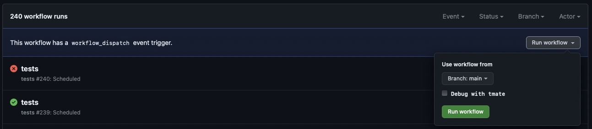

# How to debug tests (Github Actions)

The tests workflow can pause and hand you a terminal on the GitHub Actions runner, using [upterm](https://github.com/owenthereal/action-upterm). Access is limited to whoever started the workflow, and authentication uses the SSH keys registered on that GitHub account.

1. You need an SSH-key registered with GitHub. You either pick the key you have already used with `github.com` or you create a dedicated new one with `ssh-keygen -t ed25519 -a 64 -f upterm_ed25519 -C "$(date +'%d-%m-%Y')"` and add it at `https://github.com/settings/keys`.

2. If you created a dedicated key, add the following snippet to `~/.ssh/config`:

    ```
    Host uptermd.upterm.dev
        PreferredAuthentications publickey
        IdentitiesOnly yes
        IdentityFile ~/.ssh/upterm_ed25519
    ```

3. Go to `https://github.com/<user>/<repo>/actions/workflows/tests.yml`.

4. Click the `Run workflow` button and you will have the option to select the branch to run the workflow from and start a debugging session by checking the `Enable remote debugging session` checkbox for this run.

    

5. After the `workflow_dispatch` event was triggered, click the `All workflows` link in the sidebar and then click the `tests` action in progress workflow.

6. Pick one of the jobs in progress in the sidebar.

7. Wait until the current task list reaches the `Setup upterm session` step and the output shows something like:

    ```
    ➤ SSH:
        ssh 0963Vq8EQx1ExEKHdlK2@uptermd.upterm.dev
    ➤ SFTP:
        sftp 0963Vq8EQx1ExEKHdlK2@uptermd.upterm.dev
    ➤ SCP:
        scp <local> 0963Vq8EQx1ExEKHdlK2@uptermd.upterm.dev:<remote>
        scp 0963Vq8EQx1ExEKHdlK2@uptermd.upterm.dev:<remote> <local>
    ```

8. Copy and execute the `ssh` line in the terminal, which attaches you to a `tmux` session on the runner. Use the `sftp` or `scp` lines instead to copy files off the runner or onto it.

9. Start the Bats test with `bats ./tests/test.bats`.

10. The session stays open until you `exit` it or the workflow is cancelled.

For a more detailed documentation see [action-upterm](https://github.com/owenthereal/action-upterm) and [upterm](https://github.com/owenthereal/upterm).
